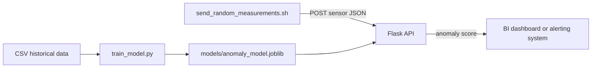

# IoT Factory Stream Processing

This project trains a simple anomaly detection model for factory equipment and exposes it through a Flask REST API. It uses the supplied AI4I predictive-maintenance dataset.

## Architecture



The dataset does not contain humidity or sound-volume measurements. The implementation therefore uses available production indicators: air temperature, process temperature, rotational speed, torque, and tool wear. `Machine failure` is the binary anomaly label.

## Setup

Run these commands from the project root in PowerShell:

```powershell
python -m venv .venv
.\.venv\Scripts\Activate.ps1
python -m pip install --upgrade pip
pip install -r requirements.txt
```

## Train the model

```powershell
python train_model.py
```

This writes the serving model to `models/anomaly_model.joblib` and prints evaluation metrics to the console.

## Run the prediction service

Start Flask after training, in a separate terminal:

```powershell
python app.py
```

The API runs on `http://127.0.0.1:5001`.

Check its status:

```powershell
Invoke-RestMethod http://127.0.0.1:5001/health
```

Request a prediction:

```powershell
$body = @{ 
  'Air temperature' = 298.1
  'Process temperature' = 308.6
  'Rotational speed' = 1551
  Torque = 42.8
  'Tool wear' = 0
} | ConvertTo-Json
Invoke-RestMethod http://127.0.0.1:5001/predict -Method Post -ContentType 'application/json' -Body $body
```

## Send synthetic measurements

With Flask running, use Git Bash to send twenty synthetic measurements at one-second intervals. The values remain in the dataset's operating ranges but are not copied from it: ten nominal scenarios and ten degradation patterns intended to trigger anomaly alerts.

```bash
chmod +x send_random_measurements.sh
./send_random_measurements.sh
```

Set `API_URL` or `INTERVAL` to change the prediction endpoint or delay between calls:

```bash
API_URL=http://127.0.0.1:5001/predict INTERVAL=0.5 ./send_random_measurements.sh
```

The API response has an `anomaly_score` between 0 and 1, `is_anomaly`, and the active alert `threshold`. The default threshold is `0.30`, favoring earlier detection of rare failures. Override it at serving time with `ANOMALY_THRESHOLD`, for example `$env:ANOMALY_THRESHOLD = '0.40'`.