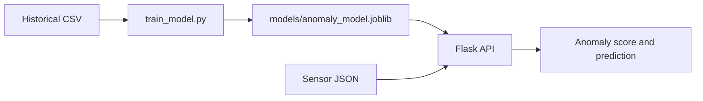

# IoT Factory Stream Processing

This project trains an anomaly-detection model for factory equipment and serves predictions through a Flask REST API. It uses the supplied AI4I predictive-maintenance dataset.

The model uses these five sensor fields:

| Field | Description |
| --- | --- |
| `Air temperature` | Air temperature in kelvin |
| `Process temperature` | Process temperature in kelvin |
| `Rotational speed` | Rotational speed in revolutions per minute |
| `Torque` | Torque in newton-metres |
| `Tool wear` | Tool wear in minutes |

`Machine failure` is the binary target used during training. The dataset does not contain humidity or sound-volume measurements, so those fields are not accepted by the prediction API.

## Project flow



## Prerequisites

- Python 3.10 or newer
- `pip`
- `curl` for the request examples
- Git Bash if you want to run `send_random_measurements.sh` on Windows

All commands below should be run from the project root, the directory containing `app.py` and `predictive_maintenance.csv`.

## Installation

### Windows PowerShell

Create and activate a virtual environment, then install the dependencies:

```powershell
python -m venv .venv
.\.venv\Scripts\Activate.ps1
python -m pip install --upgrade pip
python -m pip install -r requirements.txt
```

If PowerShell blocks the activation script, allow scripts for the current terminal only and activate again:

```powershell
Set-ExecutionPolicy -Scope Process -ExecutionPolicy RemoteSigned
.\.venv\Scripts\Activate.ps1
```

### Linux or macOS

```bash
python3 -m venv .venv
source .venv/bin/activate
python -m pip install --upgrade pip
python -m pip install -r requirements.txt
```

## Train the model

Run training once after installation:

```powershell
python train_model.py
```

On Linux or macOS, use `python3 train_model.py` if `python` does not point to Python 3.

The command validates the CSV, prints evaluation metrics, and writes the serving model to `models/anomaly_model.joblib`. The default anomaly threshold is `0.30`.

Optional training arguments:

```text
--data <path>         Training CSV path (default: predictive_maintenance.csv)
--model-path <path>   Output model path (default: models/anomaly_model.joblib)
--threshold <value>   Alert threshold between 0 and 1 (default: 0.30)
```

For example:

```powershell
python train_model.py --threshold 0.40
```

## Start the API

The model must be trained before starting the API because it is loaded when the application starts.

```powershell
python app.py
```

```bash
python3 app.py
```

The service listens on `http://127.0.0.1:5001`. Keep this terminal running and use a second terminal for requests.

### Configuration

The following environment variables are optional:

| Variable | Default | Purpose |
| --- | --- | --- |
| `PORT` | `5001` | Port used by Flask |
| `MODEL_PATH` | `models/anomaly_model.joblib` | Path to the trained model |
| `ANOMALY_THRESHOLD` | Threshold saved in the model (`0.30` by default) | Serving-time alert threshold |

PowerShell example:

```powershell
$env:PORT = '8000'
$env:ANOMALY_THRESHOLD = '0.40'
python app.py
```

Linux or macOS example:

```bash
PORT=8000 ANOMALY_THRESHOLD=0.40 python3 app.py
```

## Test the API with curl

### Health check

```bash
curl http://127.0.0.1:5001/health
```

A healthy response includes the loaded model fields and active threshold:

```json
{
  "model_features": ["Air temperature", "Process temperature", "Rotational speed", "Torque", "Tool wear"],
  "status": "ok",
  "threshold": 0.3
}
```

### Simple prediction request

```bash
curl --request POST http://127.0.0.1:5001/predict \
  --header "Content-Type: application/json" \
  --data '{"Air temperature":298.1,"Process temperature":308.6,"Rotational speed":1551,"Torque":42.8,"Tool wear":0}'
```

The response contains a probability-like `anomaly_score`, a Boolean `is_anomaly`, and the active `threshold`:

```json
{
  "anomaly_score": 0.012345,
  "is_anomaly": false,
  "threshold": 0.3
}
```

The exact score depends on the trained model. A measurement is flagged when `anomaly_score >= threshold`.

The same request works in Windows PowerShell with its native `curl.exe`:

```powershell
curl.exe --request POST http://127.0.0.1:5001/predict `
  --header "Content-Type: application/json" `
  --data '{"Air temperature":298.1,"Process temperature":308.6,"Rotational speed":1551,"Torque":42.8,"Tool wear":0}'
```

### Validation error examples

Missing fields return HTTP 400:

```bash
curl --request POST http://127.0.0.1:5001/predict \
  --header "Content-Type: application/json" \
  --data '{"Air temperature":298.1}'
```

The API also returns HTTP 400 when the body is not a JSON object or when a sensor value is not numeric.

## Send synthetic measurements

With Flask running, `send_random_measurements.sh` sends twenty measurements at one-second intervals: ten nominal scenarios followed by ten degradation patterns intended to trigger anomaly alerts.

From Git Bash:

```bash
chmod +x send_random_measurements.sh
./send_random_measurements.sh
```

Change the endpoint or delay between requests with `API_URL` and `INTERVAL`:

```bash
API_URL=http://127.0.0.1:5001/predict INTERVAL=0.5 ./send_random_measurements.sh
```

## Troubleshooting

- `Model not found`: run `python train_model.py` from the project root, or set `MODEL_PATH` to an existing model file.
- `Connection refused`: start `app.py` and check that the request uses the configured `PORT`.
- HTTP 400 from `/predict`: send all five required fields as numeric JSON values.
- `curl` is not recognized on Windows: use `curl.exe` in PowerShell or run the command from Git Bash.